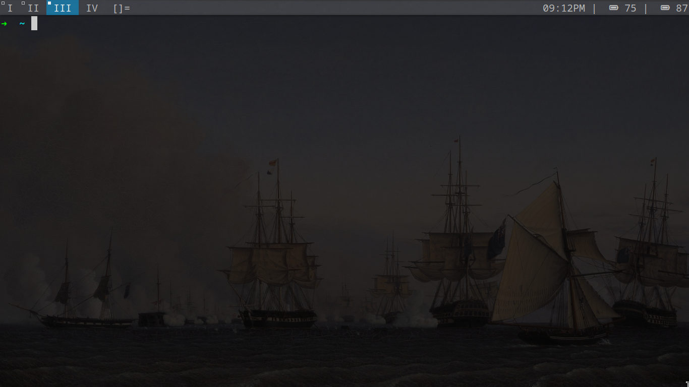

# dwm-build
My dwm build with dwmblocks status bar



## Taking Screenshots
- **Clipboard**: Press `Alt + Shift + P` to take a screenshot and copy it to the clipboard.
- **File**: Press `Alt + Shift + Control + P` to take a screenshot and save it as a file in the home directory with a timestamp.

## Key Bindings

- **Launching Dmenu**: Press `Alt + P` to open Dmenu, allowing you to launch applications.
- **Launching Terminal**: Press `Alt + Shift + Enter` to open the terminal.
- **Toggling Bar**: Press `Alt + B` to toggle the visibility of the top bar.
- **Managing Windows**:
  - **Switch Focus**: Use `Alt + J/K` to move focus to the next/previous window.
  - **Rotate Stack**: Use `Alt + Shift + J/K` to rotate the window stack.
  - **Close Window**: Press `Alt + Shift + C` to close the focused window.
- **Layouts**:
  - **Tiled Layout**: Press `Alt + T` to set the layout to tiled.
  - **Floating Layout**: Press `Alt + F` to set the layout to floating.
  - **Monocle Layout**: Press `Alt + M` to set the layout to monocle.
  - **Toggle Fullscreen**: Press `Alt + Space` to toggle fullscreen for the focused window.
- **Master Area**:
  - **Increase/Decrease Size**: Use `Alt + I/D` to adjust the size of the master area.
  - **Zoom**: Press `Alt + Enter` to zoom in on the focused window.
- **Tag Navigation**:
  - **Switch Tags**: Use `Alt + 1-4` to switch between tags.
  - **Toggle Tags**: Press `Alt + Shift + 1-4` to toggle windows to/from tags.
- **Miscellaneous**:
  - **Toggle Floating**: Press `Alt + Shift + Space` to toggle the floating state of the focused window.
  - **Toggle Alternative Tags Display**: Press `Alt + N` to toggle the alternative tags display.
- **Quitting DWM**: Press `Alt + Shift + Q` to quit DWM.

## Installation

1. Clone the repository:

   ```bash
   git clone https://github.com/bazizikhaled/dwm-build
  cd dwm
  sudo make clean install
  ```
   ```bash
   git clone https://github.com/bazizikhaled/dwm-build
  cd dwmblocks 
  sudo make clean install
  ```
   ```bash
  cp .dwm ~
  ```


